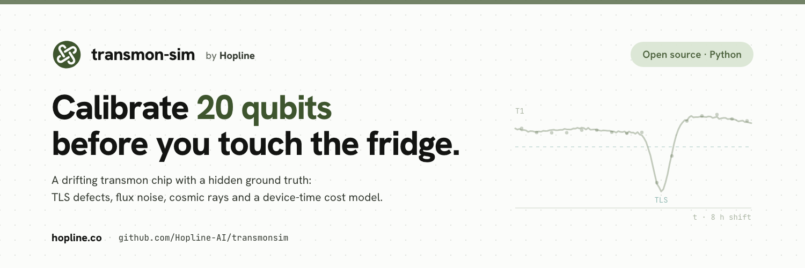

<p align="center"></p>

# Transmon Sim

A drifting 20-qubit transmon device with a hidden ground truth and an explicit measurement
cost model, for building calibration policies without a fridge.

You issue measurement requests, pay for them in seconds of device occupancy, and get noisy
data back. You never see the truth. The device drifts underneath you whether you measure it
or not.

```python
from transmon_sim import MockQPU, SimInstrument, MeasurementRequest, Routine
from transmon_sim.analysis import fit_t1

qpu = MockQPU(n_qubits=20, seed=0)
inst = SimInstrument(qpu, budget_s=8 * 3600)          # an eight-hour shift

# all a real control stack has before it powers on: the chip drawing
for q in range(20):
    d = inst.design_params(q)
    inst.apply(q, f01_hz=d["f01_hz"], pi_amp=d["pi_amp"],
               readout_freq_hz=d["readout_freq_hz"], readout_amp=d["readout_amp"])

res = inst.measure(MeasurementRequest(Routine.T1, tuple(range(20)),
                                      n_points=41, n_shots=2000))
print(f"{res.cost_s:.1f} s of device time for 20 qubits")   # 51.5

t1, sigma, ok = fit_t1(res.data[0], n_shots=2000)
print(f"q0 T1 = {t1 * 1e6:.1f} +/- {sigma * 1e6:.1f} us")   # 58.5 +/- 0.8
```

Start it cold instead, with nothing applied, and the fit returns `ok=False` and a NaN rather
than a number. No fitter here reports a confident wrong answer.

## Why

A calibration policy decides what to measure, when, and what to believe. Developing that on
real hardware is expensive: every episode spends the cold time the policy exists to save.

The model is built to be falsifiable rather than flattering. Drift is adversarial, failures
are correlated, and measurements cost what real ones cost.

## What it models

**Gate error.** Detuning, amplitude and DRAG mismatch enter quadratically near the optimum;
decoherence linearly in `t_gate/T1` and `t_gate/T2`.

**TLS defects.** Zero to three per qubit within ±120 MHz, couplings and linewidths drawn from
Klimov's Table S1. Depth follows `4*pi*g^2/width`, so a broad defect is necessarily a shallow
one. Defects diffuse, and about half hop between two frequencies. Roughly one qubit in ten sees its
T1 span more than 10x over a day, the worst losing 25x in a quarter of an hour; the rest are
barely touched.

**Flux noise.** Eight Ornstein-Uhlenbeck modes from 60 s to 1e5 s, summing to 50 kHz of
stationary frequency wander.

**Cosmic rays.** Chip-wide, one per ten seconds, 25-30 ms long, collapsing every qubit's T1 to
0.7 us at once. A correlated failure no per-qubit model predicts.

**Readout.** Two Gaussian blobs in the IQ plane, separation peaking at 21% over-drive, with
asymmetric assignment error: the excited state can decay mid-measurement, the ground state
cannot climb.

**Couplers.** A tunable coupler between each adjacent pair, carrying an effective coupling, a
static ZZ and a CZ error budget. Pairs are tuned with `Routine.CZ_PHASE`, benchmarked with
`Routine.RB_2Q`, and retuned by applying `cz_bias_hz`.

**Cost.**

```
cost = t_reconfig + n_points * n_shots * (t_init + t_seq + t_readout)
                  + per_extra * (n_qubits - 1)
```

## The rules it enforces

**No policy can read the truth.** Hidden state lives only on `MockQPU`; `SimInstrument` exposes
no accessor for it, and a test walks every public attribute to prove it.

**Physics is checked against something external.** Each error term is verified against an
independently integrated propagator and a Lindblad evolution, never against the model's own
closed form. A suite that re-derives the model agrees with it by construction - that is how a
spurious factor of pi-squared survived earlier review, and how it was eventually caught.

**Histories are reproducible.** The same seed gives the same trajectory, and measuring does not
perturb it, so two policies can be compared on a byte-identical device.

**Priors are not truth.** `design_params()` returns chip-drawing values. Fabrication scatter
moves qubit frequencies up to 120 MHz and resonators up to 22 MHz off them.

**Constants live in one file.** `constants.toml` holds every tunable value, each tagged with the
paper it came from, `modelling` where it is a choice, or `UNSOURCED` where a claimed source could
not be found. `TRANSMON_SIM_CONSTANTS` points the loader at a different file to rebuild the whole
set on another device.

## Install

```bash
uv sync
uv run python -m transmon_sim.selftest      # 5 end-to-end checks, exits non-zero on failure
uv run pytest                               # property tests
uv run --group gui marimo run gui/app.py    # parameter explorer
```

The self-test is the more interesting one: it runs a cold-start calibration loop through
measure, fit, apply and verify, and has to finish in spec.

## Limitations

**Nothing here has been validated against hardware.** No result transfers without checking.

**The default `t_reconfig` of 25 s is unsourced.** It was long attributed to a vendor reference
blueprint; a search of that blueprint found no such figure. It sets roughly two thirds of all
simulated machine time, so no machine-time result means anything without stating which value
produced it. One published instrument's scan times reproduce with no fixed term at all.

**Two-qubit error is scored only on request.** `true_in_spec` means single-qubit gate error by
default; pass `include_pairs=True` to require every CZ a qubit takes part in. On the default
device that costs 13 points of service, and far more if the couplers drift. The default is kept
so that earlier results are not silently restated.

**Crosstalk is a static matrix.** Fast-flux magnitude, about 0.01% per element, with a fall-off
borrowed from the same group's DC measurements as an assumption. At that size an uncompensated CZ
costs its spectators a median 2e-12, so measuring the elements only adds noise; a 100 ns matrix is
some 600 times larger. Drifting matrices, parallel CZ layers and pulse shapes are not modelled.

**Some constants still diverge from their sources.** Each entry in `constants.toml` says so where
it does. The largest are fabrication scatter, which lacks the large shared offset a real chip has,
and the RB decay offset. The TLS spread matches Klimov's sigma(t) = 2D*sqrt(t) only to 25-30%.

**Spectroscopy fitters trade sensitivity for honesty.** A line is certified only if it beats a
flat baseline in a look-elsewhere-corrected likelihood-ratio test, which holds pure-noise passes
under 1%. Below about 11 points a scan cannot estimate its own noise and the test turns strict.

## Citation

Cite the primary measurements named in `constants.toml`, not this repository. The physics is
theirs; only the assembly is ours.

## Licence

MIT.
